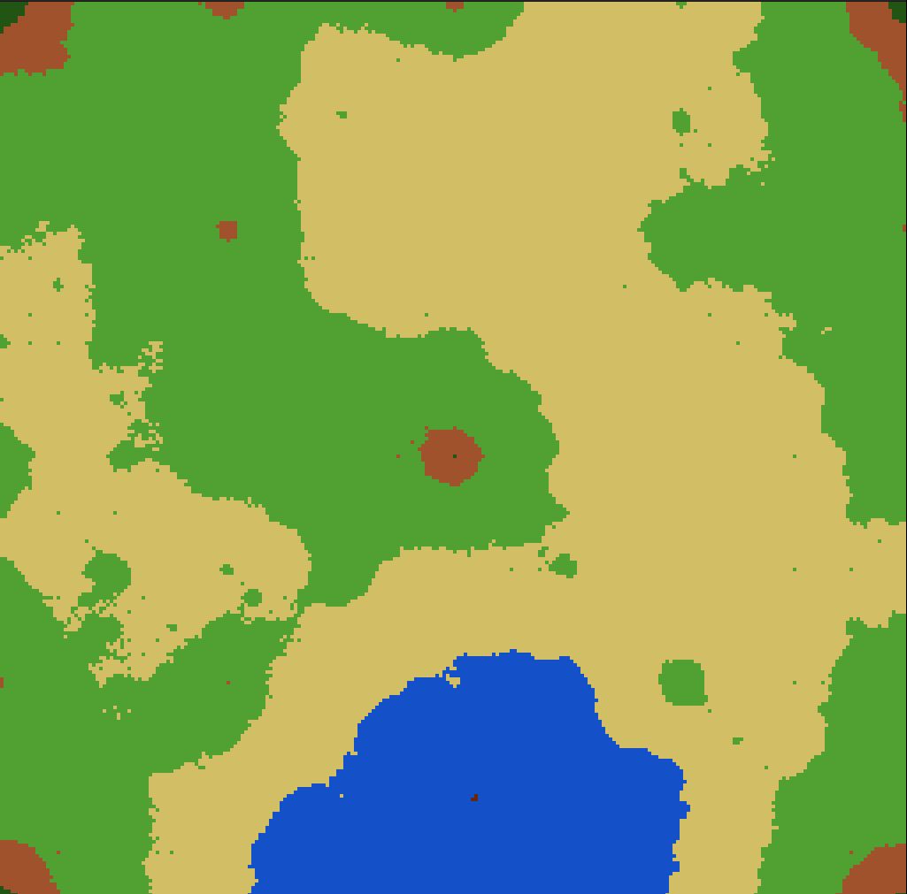
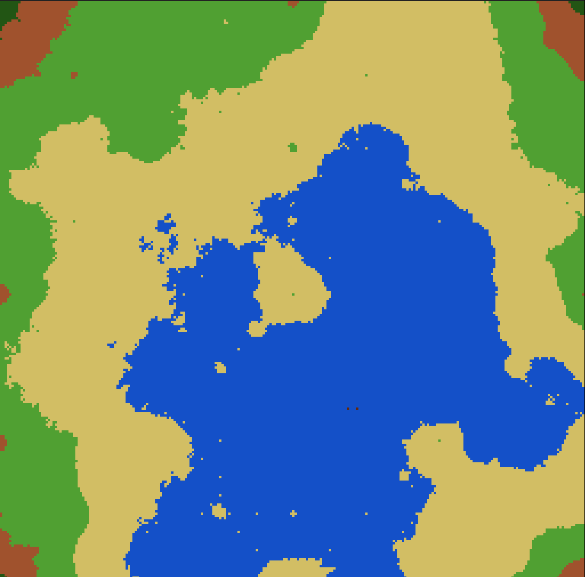
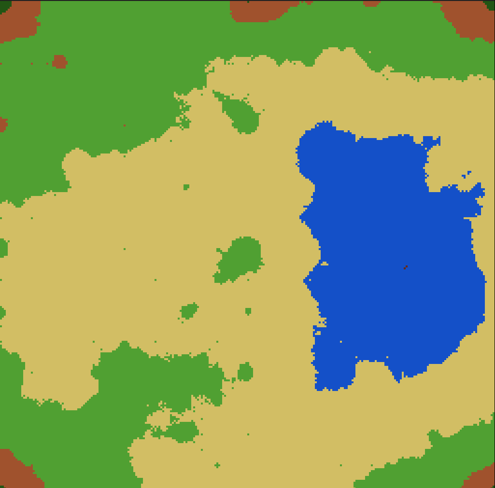

# Diamond Square — Terrain Generator in C

A minimal C implementation of the Diamond-Square algorithm for procedural terrain generation. Produces heightmaps rendered as 1024x1024 images using SDL2.

---

## Examples

<div align="center">
  
  
  
</div>

---

## Requirements

- GCC or any C compiler
- [SDL2](https://www.libsdl.org/)

On Debian/Ubuntu:
```bash
sudo apt install libsdl2-dev
```

On macOS with Homebrew:
```bash
brew install sdl2
```

---

## Build

```bash
gcc main.c -o out -lSDL2
```

---

## Run

```bash
./out
```

---

## Algorithm

The Diamond-Square algorithm is a method for generating realistic fractal terrain. Starting from a 2D grid with randomized corner values, it proceeds in two alternating steps:

- **Diamond step** — for each square in the grid, compute the midpoint and assign it the average of the four corners plus a random offset.
- **Square step** — for each diamond, compute the midpoint of each edge and assign it the average of the surrounding points plus a random offset.

The random offset is scaled down at each iteration, producing a natural-looking roughness that decreases at finer scales. The result is a heightmap with fractal properties similar to real terrain.

---

## References

- [Explanation video by SimonDev](https://www.youtube.com/watch?v=bs0BQk2hH6I)
- [Wikipedia — Diamond-square algorithm](https://en.wikipedia.org/wiki/Diamond-square_algorithm)